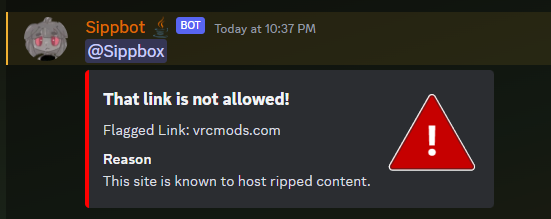
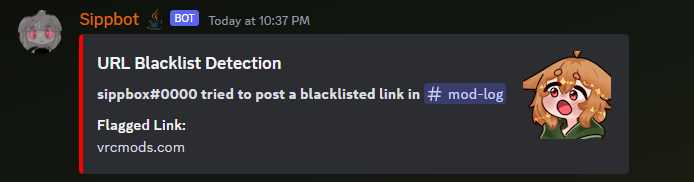
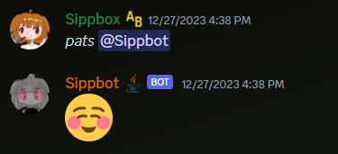
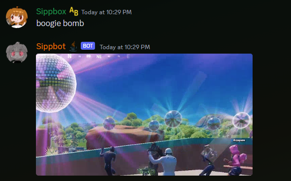

# Sippbot

Sippbot is a Discord bot written in Java using the JDA library.
It's main purpose is to provide QOL features for the Sipp's Avatar Box discord server.
This project is forked from [Nyjava](https://github.com/Nyvil/Nyjava) and is currently in development.

# Table of Contents
<!-- TOC -->
* [Sippbot](#sippbot)
* [Table of Contents](#table-of-contents)
* [Getting Started](#getting-started)
* [Features](#features)
  * [Slash Commands](#slash-commands)
    * [/blenderexport](#blenderexport)
    * [/documentation](#documentation)
    * [/messagechannel & /messageuser](#messagechannel--messageuser)
    * [/ping](#ping)
    * [/rig](#rig)
    * [/scam](#scam)
    * [/tools](#tools)
    * [/tutorial](#tutorial)
  * [Message Events](#message-events)
    * [URL Blacklist Detection](#url-blacklist-detection)
    * [Bot Headpatting](#bot-headpatting)
    * [Boogie Bomb](#boogie-bomb)
* [Contributing](#contributing)
* [Credits](#credits)
* [License](#license)
<!-- TOC -->

# Getting Started
Clone this repository and import it into your IDE of choice. I recommend IntelliJ IDEA. 

You will need to set up your own bot application on the [Discord Developer Portal](https://discord.com/developers/applications)
and make note of the token. I cannot hand out the token I use for Sippbot for security reasons.

Open the `Sippbot.java` class and run it. If you have not run the bot before, you will be prompted to enter your bot token.
The token will be saved in a file called `token.txt` in the root directory of the project and will be read from and used
the next time you run the program. This file is ignored by git, so you don't have to worry about accidentally committing it.

# Features

## Slash Commands
Sippbot uses Discord's slash command feature. You can view all the commands by typing `/` in a channel that Sippbot 
has access to.

### /blenderexport
Sends a message containing the recommended settings for exporting VRChat avatars.
(Courtesy of [catboy](https://github.com/catboy1357))

### /documentation
Provides a selection of documentation for VRChat Avatars. Upon selecting an option, the bot will send a message with 
a link to the documentation.

### /messagechannel & /messageuser
Sends a message to a channel or user in the server. The message will be sent from the bot. This command is only
available to users with the `ADMINISTRATOR` permission. Regular users can see the command, but it will not work for them.

### /ping
Sends a message containing the bots ping to the Discord API. Was included in the template project, but I left it
because I think it's neat.

### /rig
Sends an image containing the recommended rig settings for VRChat avatars.

### /scam
Takes a user ID as a parameter. Used to ban suspected scammers and automatically send a message to the user with
information about the ban. This command is only available to users with the `BAN_MEMBERS` permission.
Regular users can see the command, but it will not work for them.

### /tools
Provides links to useful tools for VRChat Avatars. Type in the name of a tool and if the name matches a tool in the
list, the bot will send a message with a link to the tool.
For example, typing `/tools poi` will send a message with a link to Poiyomi Toon Shader.

### /tutorial
Provides a selection of tutorials created by Sipp's Avatar Box. Upon selecting an option, the bot will send a message 
with a link to the tutorial.

## Message Events
Sippbot will react to certain messages in the server. These reactions are not slash commands and are not listed when 
you type `/` in a channel.

### URL Blacklist Detection
When a message is received, it checks if the message contains any URLs from dangerous sites, like VRCMods. If a 
blacklisted URL is found, it sends alerts to the avatar helper chat and the user who sent the message.

### Bot Headpatting
When a message is received, it checks if the message contains a headpatting action (ex. `*pats*`), followed by mentioning
the bot.

If it does, it will react to the message.

### Boogie Bomb
When a message is received, it checks if the message contains the phrase `boogie bomb`. If it does, it will react to the
message by selecting a random gif from a list of gif links. Dedicated to our good friend Mightybeans.

# Contributing
If you would like to contribute to this project, please fork the repository and create a pull request.
I will review it and merge it if it is appropriate.

If your pull request is a new feature, please have it make sense in the context of the bot (VRChat avatar development) 
and make sure it is well documented.

If your pull request is a bug fix, please make sure it is well documented and that it fixes the bug without breaking
anything else.

I will not accept pull requests that implement meme/joke features unless they are really, really, really funny.

# Credits
* **[Sippbox](https://github.com/Sippbox)** - Owner of SAB and this bot
* **[Nyvil](https://github.com/Nyvil)** - initial work
* **[Catboy](https://github.com/catboy1357)** - Info for /blenderexport & tool suggestions

# License
This project is licensed under the Apache 2.0 License - see the [LICENSE](https://github.com/Sippbox/Sippbot/blob/main/LICENSE) file for details.
